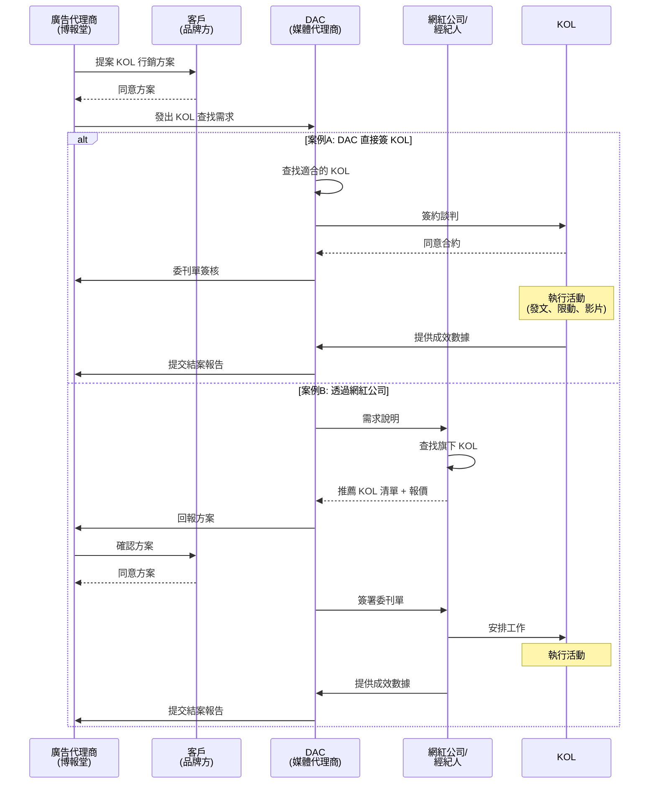

# KOL Database NextGen - 專案需求文件

> **文件版本**: v1.3
> **最後更新**: 2026-04-13
> **維護者**: Emily Cai

---

## 📋 目錄

- [1. 專案背景](#1-專案背景)
- [2. 商業邏輯](#2-商業邏輯)
- [3. 核心問題](#3-核心問題)
- [4. 解決方案](#4-解決方案)
- [5. 系統功能模組](#5-系統功能模組)
- [6. 使用者角色](#6-使用者角色)
- [7. 核心工作流程](#7-核心工作流程)
- [8. UI 架構設計](#8-ui-架構設計)
- [9. AI Agent 功能](#9-ai-agent-功能)
- [10. 收藏資料夾共享功能](#10-收藏資料夾共享功能)
- [11. 提案異動通知功能](#11-提案異動通知功能)

---

## 1. 專案背景

### 1.1 公司定位

DAC 是一家**媒體代理商**，主要業務包括：

- 為客戶代操網路廣告（Google, Facebook, LINE, Taboola 等）
- KOL 行銷服務（網紅接洽、提案、報價、執行、成效追蹤）

### 1.2 組織架構

```
廣告代理商 (博報堂/聯廣)
    ↓
  客戶 (品牌方)
    ↓
DAC 媒體代理商
├── 業務 Team - 負責第一線接洽代理商與客戶，作為溝通窗口，與 KOL Team 討論並提案 KOL
├── KOL Team - 負責找尋 KOL、與網紅公司聯絡、執行案件、提交結案報告（主要執行者）
└── Tech & BPR Team - 負責效率自動化
```

### 1.3 目前痛點

1. KOL 提案策略框架模糊
2. KOL 相關數據缺乏與規劃工具不統一
3. KOL 合作模式各異，經驗與技巧難累積
4. KOL 團隊目標、行動計畫與績效評估標準不明
5. KOL 過往數據資料庫分散未統一

### 1.4 專案目標

建立一套**內部 KOL 管理系統**，達成以下目標：

1. **資料集中化** - 統一管理 KOL 基本資料、社群數據、合作記錄
2. **流程數位化** - 從提案、簽約、執行到結案的完整追蹤
3. **知識累積** - 系統化記錄合作經驗、成效數據、評價
4. **AI 輔助決策** - 利用 AI 提升 KOL 搜尋、成效辨識、報告生成效率

---

## 2. 商業邏輯

### 2.1 KOL 業配流程

#### 流程概述


```mermaid
sequenceDiagram
    participant Agency as 廣告代理商<br/>(博報堂)
    participant Client as 客戶<br/>(品牌方)
    participant DAC as DAC<br/>(媒體代理商)
    participant MCN as 網紅公司/<br/>經紀人
    participant KOL as KOL

    Agency->>Client: 提案 KOL 行銷方案
    Client-->>Agency: 同意方案
    Agency->>DAC: 發出 KOL 查找需求

    alt 案例A: DAC 直接簽 KOL
        DAC->>DAC: 查找適合的 KOL
        DAC->>KOL: 簽約談判
        KOL-->>DAC: 同意合約
        DAC->>Agency: 委刊單簽核
        Note over KOL: 執行活動<br/>(發文、限動、影片)
        KOL->>DAC: 提供成效數據
        DAC->>Agency: 提交結案報告
    else 案例B: 透過網紅公司
        DAC->>MCN: 需求說明
        MCN->>MCN: 查找旗下 KOL
        MCN-->>DAC: 推薦 KOL 清單 + 報價
        DAC->>Agency: 回報方案
        Agency->>Client: 確認方案
        Client-->>Agency: 同意方案
        DAC->>MCN: 簽署委刊單
        MCN->>KOL: 安排工作
        Note over KOL: 執行活動
        MCN->>DAC: 提供成效數據
        DAC->>Agency: 提交結案報告
    end
```


### 2.2 委刊單類型

#### 類型 1: DAC ↔ KOL/網紅公司 的委刊單

- **格式**: PDF，各家網紅公司格式不同
- **內容**:
  - 委刊單標題
  - 客戶/品牌名稱
  - 網紅公司名稱
  - KOL 名稱
  - 合作內容（IG 貼文 x1、限動 x2、YT 影片 x1...）
  - 合作條件（授權範圍、過稿次數、急件費用...）
  - 上刊時間
  - 費用（未稅）
  - 稅金
  - 總額 (未稅+稅金)

**範例**:

> - **委刊單標題**: DAC_ALLIE_KOL行銷活動 委刊單
> - **客戶**: ALLIE
> - **網紅公司**: 雲太資訊有限公司
> - **KOL**: Gina
> - **合作內容**: YT 置入影音 x1 (約3分鐘)、IG 限動 x1
> - **合作條件**: 影片final須於上線前24小時完成，若需要調整會額外收調整急件費用
> - **上刊時間**: 2025/05/23
> - **費用**: NT$ 220,000 (未稅)
> - **稅金**: NT$ 11,000
> - **總額**: NT$ 231,000

#### 類型 2: DAC ↔ 廣告代理商 的委刊單 ⭐ 系統匯入使用此版本

- **格式**: Excel
- **用途**: 將類型 1 的委刊單整理成統一格式，方便識別與管理
- **優點**: 格式統一，易於 AI 辨識
- **缺點**: 需手動整理、品牌名稱對應仍需人工確認
- **系統處理**: 上傳後需選擇對應的提案專案，並依 Instagram ID 比對 KOL

**範例**:

> - **客戶**: 迪維數位智造股份有限公司
> - **案件名稱**: Panasonic 2025 年秋季發表會_洗碗機人選出席
> - **日期**: 2025年9月~10月
> - **KOL**: 
>   1. Lori.萌享媽咪
>   2. Yii Yang
> - **執行日期**: 9/25(四)洗碗機秋季發表會出席
> - **合作內容**:
>   1. IG 圖文一則
>   2. 限動 2 則
> - **授權項目**:
>   - 授權投廣為一個月
>   - 圖片授權原檔可再製
>   - 授權平台: Panasonic Cooking 專網、FB
> - **專案報價**: 
>   1. Lori.萌享媽咪: NT$ 25,000 (未稅)
>   2. Yii Yang: NT$ 38,000 (未稅)
> - **報價總計(未稅)**: NT$ 63,000
> - **稅金**: NT$ 3,150
> - **報價總計(含稅)**: NT$ 66,150

---

## 3. 核心問題

### 3.1 資料管理問題


| 問題       | 影響                                   |
| -------- | ------------------------------------ |
| **資料散落** | KOL 資訊、合作紀錄、成效數據分散在 Excel、截圖、Email 中 |
| **難以查找** | 「這個 KOL 之前合作過嗎？」「成效如何？」需翻找大量檔案       |
| **知識流失** | 經驗存在個人腦中，無法傳承與複用                     |
| **重複提案** | 沒有記錄「曾經提過但被拒絕」的 KOL，容易重複失誤           |


### 3.2 工作流程問題


| 問題           | 影響                     |
| ------------ | ---------------------- |
| **提案階段沒有追蹤** | 提案中的 KOL 沒有記錄，無法分析客戶偏好 |
| **手工整理耗時**   | 委刊單、成效數據需手動輸入 Excel    |
| **報告製作繁瑣**   | 結案報告需手動排版截圖、填數據，費時費力   |
| **缺少競業檢查**   | 難以快速確認 KOL 是否與競品合作過    |


### 3.3 決策支援問題


| 問題             | 影響                           |
| -------------- | ---------------------------- |
| **無法量化比較**     | 缺乏系統化的成效數據，無法比較不同 KOL 的 CP 值 |
| **找 KOL 沒有依據** | 憑印象推薦，缺少歷史數據支撐               |
| **客戶偏好不明**     | 沒有分析「客戶喜歡什麼類型的 KOL」          |


---

## 4. 解決方案

### 4.1 A 案核心設計理念（含提案追蹤）

**從「查找工具」變成「完整工作流管理」**

```
Before (現況):
查找 KOL → (黑箱) → 簽約 → (黑箱) → 結案

After (A 案系統):
建立提案專案 → AI 搜尋候選人 → 提案給客戶 → 記錄反饋
→ 調整名單 → 簽約建檔 → 追蹤執行 → 上傳成效 → 生成報告 → 留下評價
```

### 4.2 A 案關鍵功能

1. **KOL 資料庫** - 統一管理所有 KOL 的基本資料、社群數據、合作歷史
2. **提案專案系統** - 追蹤完整的提案流程，記錄客戶偏好與反饋 ⭐ A 案獨有
3. **執行案件管理** - 數位化管理合作案件，追蹤執行進度與成效
4. **AI 輔助** - 智能搜尋、成效辨識、報告生成
5. **成效追蹤** - 系統化記錄每次合作的數據與評價

### 4.3 A 案價值主張


| 角色           | 獲得的價值                            |
| ------------ | -------------------------------- |
| **業務 Team**  | 快速找到適合的 KOL、提案有數據支撐、省時間、客戶偏好可追蹤 |
| **KOL Team** | 減少手工整理、自動生成報告、經驗可複用              |
| **管理層**      | 數據化決策、分析 ROI、追蹤團隊效率、提案轉換率分析      |


---

### 4.4 B 案核心設計理念（不含提案追蹤）

**從「查找工具」直連「案件管理」**

> **背景說明**: 提案流程在實務上變動頻繁，若要求每次提案調整都需進系統記錄，將造成額外的時間成本，且一旦遺漏記錄就可能導致後續流程資訊不一致。B 案因此移除提案管理模組，改以執行案件為系統的第一個正式記錄節點。

```
Before (現況):
查找 KOL → (黑箱) → 簽約 → (黑箱) → 結案

After (B 案系統):
KOL 資料庫搜尋 → 線下提案（不進系統）→ 客戶確認
→ 執行案件建檔 → 追蹤執行 → 上傳成效 → 生成報告 → 留下評價
```

### 4.5 B 案關鍵功能

1. **KOL 資料庫** - 統一管理所有 KOL 的基本資料、社群數據、合作歷史
2. **執行案件管理** - 數位化管理合作案件，作為系統的第一個正式記錄起點
3. **AI 輔助** - 智能搜尋（輔助人工提案時查找）、成效辨識、報告生成
4. **成效追蹤** - 系統化記錄每次合作的數據與評價

### 4.6 B 案價值主張


| 角色           | 獲得的價值                               |
| ------------ | ----------------------------------- |
| **業務 Team**  | 快速找到適合的 KOL、有數據支撐、不需額外維護提案記錄、學習成本低 |
| **KOL Team** | 減少手工整理、自動生成報告、執行案件為單一作業入口、流程更簡潔      |
| **管理層**      | 數據化決策、分析 ROI、追蹤執行案件層級的效率             |


---

### 4.7 兩案功能對照


| 功能模組         | A 案 (含提案) | B 案 (無提案) | 備註                   |
| ------------ | :-------: | :-------: | -------------------- |
| KOL 資料庫      |     ✅     |     ✅     | 兩案共用                 |
| AI 智能搜尋      |     ✅     |     ✅     | 兩案共用，B 案用於輔助人工提案     |
| **提案專案管理**   |   ✅ 完整   |     ❌     | A 案核心差異點             |
| 提案客戶反饋記錄     |     ✅     |     ❌     | A 案可分析客戶偏好           |
| 提案轉執行案件       |     ✅     |     ❌     | A 案可自動帶入資料           |
| **執行案件管理**    |     ✅     |     ✅     | 兩案共用，B 案為第一入口        |
| 委刊單 Excel 匯入 |     ✅     |     ✅     | 兩案共用                 |
| 成效追蹤與 OCR   |     ✅     |     ✅     | 兩案共用                 |
| 結案報告生成       |     ✅     |     ✅     | 兩案共用                 |
| 合作評價記錄       |     ✅     |     ✅     | 兩案共用                 |
| 系統設定         |     ✅     |     ✅     | 兩案共用                 |


---

### 4.8 方案優缺點分析

#### A 案（含提案追蹤）


| 面向   | 優點                                            | 缺點                                              |
| ---- | --------------------------------------------- | ----------------------------------------------- |
| 資料完整性 | 記錄提案到結案的完整軌跡，可分析哪類 KOL 更易被客戶接受              | 提案流程若未即時更新，資料會失真                                |
| 決策支援 | 可統計提案接受率、客戶偏好，協助未來提案策略                        | 初期建置與維護成本較高                                     |
| 使用門檻 | 功能完整，適合有嚴謹流程管理需求的環境                           | 每次提案異動（KOL 換人、調整報價）都需進系統記錄，有額外的時間成本            |
| 風險   | 若記錄習慣不佳，資料品質將不穩定，可能讓後續分析失準                   | —                                               |


#### B 案（無提案追蹤）


| 面向   | 優點                                     | 缺點                                  |
| ---- | -------------------------------------- | ----------------------------------- |
| 操作效率 | 提案流程維持線下作業，不強制進系統，降低操作負擔              | 提案階段的資訊（被拒絕的 KOL、客戶反饋）無法系統化留存       |
| 使用門檻 | 委刊單為唯一作業入口，流程簡洁、學習成本低，容易推廣            | 無法從資料庫分析客戶偏好或提案轉換率                  |
| 資料一致性 | 系統中的資料皆為確定成案的委刊單，資料可靠性高                | 少了提案記錄，KOL 被拒絕的原因可能隨時間流失            |
| 風險   | 提案階段的知識（哪些 KOL 不受該客戶青睞）仍存在個人腦中，難以傳承    | —                                   |


> **💡 決策建議**: 若團隊目前提案流程較靈活、KOL 換人頻率高，或人力資源有限，**建議優先採用 B 案**，待系統使用習慣建立後，再評估是否引入提案管理模組。若未來提案流程趨於穩定，可以 A 案為長期目標進行迭代升級。

---

## 5. 系統功能模組

### 功能架構圖

```text
┌─────────────────────────────────────────────────────────────┐
│                  KOL Database NextGen                       │
├─────────────────────────────────────────────────────────────┤
│                                                             │
│  ┌────────────┐  ┌────────────┐  ┌────────────┐            │
│  │  認證系統  │  │  首頁      │  │  資料管理  │            │
│  │            │  │            │  │            │            │
│  │ • BetterAuth │  │ • 儀表板   │  │ • 客戶設定 │            │
│  │ • OAuth 登入│  │ • 統計數據 │  │ • 標籤管理 │            │
│  │ • 權限控管 │  │ • 近期動態 │  │ • 收藏/最愛│            │
│  └────────────┘  └────────────┘  └────────────┘            │
│                                                             │
│  ┌────────────┐  ┌────────────┐  ┌────────────┐            │
│  │  KOL 管理  │  │  提案系統  │  │  委刊單    │            │
│  │            │  │            │  │  管理      │            │
│  │ • 人選一覽 │  │ • 專案建立 │  │ • 案件一覽 │            │
│  │ • 詳細資料 │  │ • KOL 挑選 │  │ • 詳細資訊 │            │
│  │ • 快速建檔 │  │ • 狀態追蹤 │  │ • 表單建立 │            │
│  │ • 合作紀錄 │  │ • 提案匯出 │  │ • 財務明細 │            │
│  └────────────┘  └────────────┘  └────────────┘            │
│                                                             │
│  ┌────────────┐  ┌────────────┐                            │
│  │  AI Agent  │  │  成效追蹤  │                            │
│  │  核心功能  │  │  與報告    │                            │
│  │ • 智能查詢 │  │ • 結案報告 │                            │
│  │ • 截圖辨識 │  │ • 預覽編輯 │                            │
│  │ • Excel解析│  │ • 匯出 PDF │                            │
│  └────────────┘  └────────────┘                            │
│                                                             │
└─────────────────────────────────────────────────────────────┘
```

---

## 6. 使用者角色

### 6.1 角色定義


| 角色                                 | 權限   | 主要使用功能              |
| ---------------------------------- | ---- | ------------------- |
| **Admin**                          | 完整權限 | 所有功能 + 系統設定         |
| **Manager** (業務主管、KOL Team Leader) | 管理權限 | 查看所有專案、編輯、審核        |
| **Member** (業務、KOL Team 成員)        | 基本權限 | 查看 KOL、建立提案、管理自己的專案 |


### 6.2 使用情境

#### 業務人員 (Member/Manager)

- **需求**: 作為溝通窗口，協調代理商、客戶與 KOL Team，提案 KOL 給客戶
- **使用流程**:
  1. 建立提案專案
  2. 與 KOL Team 討論需求
  3. 匯出提案文件給客戶
  4. 記錄客戶反饋
  5. 成案後由轉為執行案件
  6. 將 KOL 結案報告轉為最終版報告並上傳

#### KOL Team 成員 (Member/Manager)

- **需求**: 管理執行中的案件，追蹤成效，產生報告
- **使用流程**:
  1. KOL Team 管理與上傳 KOL 資料
  2. 收到業務提案需求後搜尋並整理候選名單
    1. 使用 AI 搜尋
    2. 使用查找與篩選功能搜尋 
  3. 查看委刊單詳細
  4. 上傳貼文截圖
  5. 使用 AI OCR 辨識成效數據
  6. 填寫合作評價
  7. 生成結案報告

#### 管理層 (Manager/Admin)

- **需求**: 查看整體數據、分析 ROI、管理團隊
- **使用流程**:
  1. 查看 Dashboard 統計
  2. 檢視各案件狀態
  3. 分析 KOL 成效表現
  4. 管理客戶、品牌、標籤

---

## 7. 核心工作流程

### 📌 A 案 (提案轉執行案件)

### A.1 工作流 1: KOL 建檔

```
觸發: 發現新的 KOL
    ↓
填寫基本資料 (姓名、聯絡方式)
    ↓
新增社群平台連結 (IG, YT, FB...)
    ↓
點擊「取得追蹤數」→ 自動爬取粉絲數 (Apify API)
    ↓
補充標籤、報價區間
    ↓
送出建檔 → 存入資料庫
```

### A.2 工作流 2: 建立提案專案

```
觸發: 廣告代理商/客戶提出 KOL 需求
    ↓
建立提案專案 (填寫客戶、品牌、預算、需求)
    ↓
AI 智能搜尋 KOL
  - 輸入自然語言: "找粉絲 5 萬以上、母嬰類、沒合作過競品"
  - AI 理解需求 → 查詢資料庫
  - 回傳推薦名單 + 推薦理由
    ↓
人工篩選與調整
  - 加入候選名單
  - 標記為「已提案」
    ↓
匯出提案文件 (Excel)
    ↓
客戶反饋
  - 接受 → 標記為「接受」
  - 拒絕 → 標記為「拒絕」+ 記錄原因
    ↓
如需要 → 繼續搜尋補充 KOL
    ↓
客戶確認 → 轉為委刊單
```

### A.3 工作流 3: 執行案件建檔 → 執行 → 結案

```
觸發: 提案成案後
    ↓
建立委刊單
  - 方式 1: 從提案專案自動帶入資料
  - 方式 2: 上傳委刊單 Excel (與 Agency 的版本) → 選擇對應的提案專案 → 比對 KOL (依 Instagram ID)
    ↓
人工確認與編輯
    ↓
追蹤執行進度
  - 待簽約 → 製作中 → 已上線 → 已結案
    ↓
上傳貼文截圖
  - 按版位分類 (IG 貼文、限動、Reels...)
    ↓
上傳成效截圖 → AI OCR 辨識數據
  - 自動提取: 曝光數、觸及、按讚、留言...
  - 人工確認修正
    ↓
填寫合作評價
  - 星級評分 (1-5)
  - 外部評論 (給客戶看)
  - 內部評論 (內部參考)
    ↓
生成結案報告
  - 選擇 KOL
  - AI 生成 PPT 草稿
  - 業務修正後上傳正式版
    ↓
資料回流 → 更新 KOL 評價與成效統計
```

### 📌 B 案 (自行上傳委刊單)

### B.1 工作流 1: KOL 建檔

```
觸發: 發現新的 KOL
    ↓
填寫基本資料 (姓名、聯絡方式)
    ↓
新增社群平台連結 (IG, YT, FB...)
    ↓
點擊「取得追蹤數」→ 自動爬取粉絲數 (Apify API)
    ↓
補充標籤、報價區間
    ↓
送出建檔 → 存入資料庫
```

### B.2 工作流 2: 建立提案專案

```
觸發: 廣告代理商/客戶提出 KOL 需求
    ↓
KOL Team 尋找合適的 KOL
    ↓
AI 智能搜尋 KOL
  - 輸入自然語言: "找粉絲 5 萬以上、母嬰類、沒合作過競品"
  - AI 理解需求 → 查詢資料庫
  - 回傳推薦名單 + 推薦理由
    ↓
將 KOL 人選提給業務
    ↓
業務提交提案文件
    ↓
客戶反饋
  - 接受 → 標記為「接受」
  - 拒絕 → 標記為「拒絕」+ 記錄原因
    ↓
如需要 → 繼續搜尋補充 KOL
    ↓
客戶確認 → 產生委刊單
```

### B.3 工作流 3: 執行案件建檔 → 執行 → 結案

```
執行案件成立
    ↓
系統中建立執行案件
  - 方式: 上傳委刊單 Excel (與 Agency 的版本) → 選擇對應的提案專案 → 比對 KOL (依 Instagram ID)
    ↓
KOL 合作開跑
    ↓
KOL 合作結束
    ↓
上傳貼文截圖
  - 按版位分類 (IG 貼文、限動、Reels...)
    ↓
上傳成效截圖 → AI OCR 辨識數據
  - 自動提取: 曝光數、觸及、按讚、留言...
  - 人工確認修正
    ↓
填寫合作評價
  - 星級評分 (1-5)
  - 外部評論 (給客戶看)
  - 內部評論 (內部參考)
    ↓
生成結案報告
  - 選擇 KOL
  - AI 生成 PPT 草稿
  - 業務修正後上傳正式版
    ↓
資料回流 → 更新 KOL 評價與成效統計
```

---

## 8. UI 架構設計

### 8.1 導航結構

```
首頁 (Dashboard)
├── KOL 管理
│   ├── KOL 一覽頁 (列表、篩選、搜尋)
│   ├── KOL 詳細頁 (跨案件統計)
│   └── KOL 建檔頁
│
├── 提案專案 ⭐ 核心新功能
│   ├── 提案專案一覽
│   ├── 提案專案詳細 (AI 搜尋、候選人管理)
│   └── 新增提案專案
│
├── 執行案件管理
│   ├── 執行案件一覽頁 (卡片式)
│   ├── 執行案件詳細頁 (三層 Accordion)
│   ├── 執行案件建檔頁 (AI 解析)
│   └── 成效一覽頁
│
├── 我的收藏
│   └── 收藏頁 (資料夾管理)
│
├── 結案報告
│   ├── 報告一覽頁 (版本管理)
│   ├── 生成報告
│   └── 報告預覽頁
│
└── 設定
    ├── 客戶管理
    ├── 品牌管理
    ├── 標籤管理
    └── 系統設定
```

### 8.2 雙入口設計：KOL 視角 vs 案件視角

#### 設計理念

提供兩種資料檢視視角，滿足不同使用情境：


| 視角         | 入口               | 適用情境        | 核心功能              |
| ---------- | ---------------- | ----------- | ----------------- |
| **KOL 視角** | KOL 一覽 → KOL 詳細頁 | 推薦 KOL 給客戶  | 查看跨案件表現、價格趨勢、合作歷史 |
| **案件視角**   | 執行案件一覽 → 執行案件詳細頁   | 追蹤案件進度、產生報告 | 查看案件所有 KOL、整體成效   |


#### 互相跳轉

```
KOL 詳細頁 ←→ 執行案件詳細頁
   ↓              ↓
點擊案件編號  點擊 KOL 名稱
```

**URL 設計範例**:

- `/kols/gina` → KOL 詳細頁
- `/kols/gina?from=campaign-12345` → 高亮該案件
- `/campaigns/12345` → 執行案件詳細頁
- `/campaigns/12345?expand=gina` → 自動展開 Gina 的資料

---

## 9. AI Agent 功能

### 9.1 Agent 1: KOL 智能搜尋與推薦

#### 功能描述

接收自然語言查詢，轉換為資料庫查詢，並根據歷史數據推薦 KOL。

#### 使用情境

```
用戶輸入:
"找粉絲數 5 萬以上、母嬰或生活類、沒合作過 Panasonic 競品、互動率 5% 以上的 KOL"

AI 處理:
1. 理解查詢意圖 → 提取結構化條件
2. 識別「Panasonic 競品」→ 查詢產業關係或預設競品列表
3. 查詢資料庫 → 排除已拒絕的 KOL、競業合作紀錄
4. 計算匹配度 → 綜合粉絲數、標籤、互動率、歷史評價
5. 生成推薦理由

輸出結果:
- KOL 名單 (依匹配度排序)
- 每個 KOL 的匹配分數 (0-100)
- 推薦理由 (例如: "粉絲數符合、標籤匹配、未合作過競品、互動率高於要求")
```

#### 技術方案

- **Claude API** + **MCP Server**
- **NL2SQL** - 自然語言轉 SQL 查詢
- **Function Calling** - 呼叫資料庫查詢工具

### 9.2 Agent 2: 成效 OCR 辨識

#### 功能描述

上傳成效截圖（Instagram、Facebook、YouTube 等平台），AI 自動辨識數據。

#### 使用情境

```
輸入: IG 成效截圖 (Insights)
    ↓
AI 辨識:
- 曝光數 (Impressions): 50,000
- 觸及人數 (Reach): 35,000
- 按讚數 (Likes): 1,200
- 留言數 (Comments): 45
- 分享數 (Shares): 23
- 收藏數 (Saves): 156
    ↓
輸出: 結構化 JSON 數據
    ↓
人工確認/修正 (如需要)
    ↓
存入資料庫
```

#### 技術方案

- **Claude Vision API** (支援圖片輸入)
- **Structured Output** (回傳 JSON 格式)

### 9.3 Agent 3: 結案報告生成

#### 功能描述

根據案件資料、KOL 成效、截圖，自動生成 PowerPoint 結案報告。

#### 使用情境

```
輸入:
- 案件資料 (名稱、客戶、預算)
- KOL 清單 (名稱、價格、服務項目)
- 成效數據 (曝光、互動...)
- 貼文截圖、成效截圖

AI 生成:
1. 分析數據 → 產生「執行摘要」、「總結與建議」
2. 為每個 KOL 的每個版位生成「成效評語」
   例如: "此次 Reels 互動率達 4.2%，高於美妝產業平均 2.8%，表現優異"

後端處理:
1. 使用 PptxGenJS 建立 PPT
2. 套用模板 (公司標準/簡約/無模板)
3. 填入資料、插入截圖
4. 上傳到 Cloud Storage
5. Web Push 通知用戶

輸出:
- PPT 草稿檔案 (系統版本)
- 可下載連結
```

---

## 10. 收藏資料夾共享功能

### 10.1 功能背景

原有的收藏機制（`kols.isFavorite`）僅支援個人標記，無法分類管理，也無法讓同組或跨組同事共同維護 KOL 名單。此功能將收藏升級為「資料夾式共享收藏」。

### 10.2 核心功能

| 功能 | 說明 |
|------|------|
| **建立資料夾** | 任何成員皆可建立個人收藏資料夾，並附上說明 |
| **加入 KOL** | 將 KOL 加入指定資料夾，可附上備註（例如「適合親子類提案」） |
| **共享給指定人** | 選擇 `shareType = 'user'`，共享給特定同事 |
| **共享給整組** | 選擇 `shareType = 'group'`，共享給 AE / KOL / Tech / Media 等組別 |
| **權限控制** | `view`（唯讀）或 `edit`（可新增 KOL 進資料夾） |

### 10.3 使用情境

```
KOL Team 成員建立「美妝類精選」資料夾
    ↓
加入 10 位 KOL，並附上各自備註
    ↓
共享給 AE 組（permission = 'view'）
    ↓
AE 開提案時可直接從共享資料夾挑選 KOL
    ↓
AE 也可共享資料夾給特定業務同事並給予 edit 權限
    ↓
雙方共同維護同一份 KOL 清單
```

### 10.4 資料表設計

| 資料表 | 職責 |
|--------|------|
| `kol_favorite_folders` | 資料夾本體，綁定建立者 (`ownerId → users`) |
| `kol_favorite_folder_items` | 資料夾 ↔ KOL 中間表，`(folderId, kolId)` 聯合唯一 |
| `kol_favorite_folder_shares` | 資料夾 ↔ 共享對象中間表，區分 user / group 兩種模式 |

> 詳細欄位請參考 `docs/ERD.md`。

### 10.5 權限規則

- 資料夾 **owner** 可編輯、刪除資料夾，以及新增 / 移除共享對象
- `permission = 'edit'` 的共享者可新增 KOL，`addedBy` 記錄操作者
- `permission = 'view'` 的共享者僅能瀏覽，無法異動

---

## 11. 提案異動通知功能

### 11.1 功能背景

提案通常由跨組人員（業務 + KOL Team）共同維護。當不同組的同事修改提案內容（如調整 stage、新增 KOL、加入 feedback）時，相關人員無從得知，導致資訊落差。此功能透過訂閱機制，在提案有異動時即時通知相關使用者。

### 11.2 核心功能

| 功能 | 說明 |
|------|------|
| **自動訂閱** | 提案建立者（owner）自動成為 watcher；被 @ 的人也自動加入 |
| **手動訂閱** | 任何人可手動點擊「追蹤此提案」 |
| **異動通知** | 有人更新提案時，所有 watcher 收到通知 |
| **通知類型** | `proposal.stage_changed`、`proposal.kol_added`、`proposal.feedback_added` 等 |
| **已讀管理** | 每則通知有 `isRead` 狀態，支援「標為已讀」、「全部已讀」 |

### 11.3 通知觸發邏輯

```
觸發事件（由後端 Action 層執行）
    ↓
查詢 proposal_watchers（訂閱此提案的所有 userId）
    ↓
排除操作者本人（actor 不通知自己）
    ↓
批次寫入 notifications（每位 watcher 一筆）
    ↓
前端輪詢 or Server-Sent Events 推送未讀通知數
```

### 11.4 訂閱類型（watchType）

| 類型 | 觸發時機 |
|------|----------|
| `owner` | 提案建立時，負責人自動訂閱 |
| `mentioned` | 在 feedback 或備註中被 @ 時自動訂閱 |
| `manual` | 使用者手動點擊「追蹤提案」 |

### 11.5 通知訊息範例

| 事件類型 | 通知文字範例 |
|----------|-------------|
| `proposal.stage_changed` | `Emily 將提案《Panasonic Q3提案》從 draft 更新為 review` |
| `proposal.kol_added` | `Chloe 在提案《ALLIE夏季提案》中加入了 KOL Gina` |
| `proposal.feedback_added` | `Jason 在提案《ALLIE夏季提案》新增了客戶反饋` |

### 11.6 資料表設計

| 資料表 | 職責 |
|--------|------|
| `proposal_watchers` | 提案 ↔ 訂閱者中間表，`(proposalId, userId)` 聯合唯一 |
| `notifications` | 通知本體，含 `type`、`payload`、`isRead`、`actorId` |

> 詳細欄位請參考 `docs/ERD.md`。
