# KOL-DB-Demo — Entity Relationship Diagram & 資料結構

> Schema 來源：`db/drizzle/schema.ts`、`db/drizzle/relations.ts`
> ORM：Drizzle ORM + PostgreSQL

---

## ERD (Mermaid)

```mermaid
erDiagram
    %% ─── Auth 區塊 ───
    USERS {
        text id PK
        text name
        text email UK
        boolean emailVerified
        text image
        varchar role
        timestamp createdAt
        timestamp updatedAt
    }
    SESSIONS {
        text id PK
        timestamp expiresAt
        text token UK
        text userId FK
        text ipAddress
        text userAgent
    }
    ACCOUNTS {
        text id PK
        text accountId
        text providerId
        text userId FK
        text accessToken
        text refreshToken
        text password
    }
    VERIFICATIONS {
        text id PK
        text identifier
        text value
        timestamp expiresAt
    }

    USERS ||--o{ SESSIONS : "has"
    USERS ||--o{ ACCOUNTS : "has"

    %% ─── KOL 區塊 ───
    KOLS {
        text id PK
        varchar displayName
        varchar legalName
        varchar country
        varchar platform
        integer followers
        numeric engagementRate
        numeric rating
        jsonb audienceGender
        jsonb social
        jsonb contact
        jsonb collaborationHistory
        jsonb performanceStats
        boolean isFavorite
        text avatarUrl
        timestamp createdAt
    }
    KOL_SOCIAL_ACCOUNTS {
        text id PK
        text kolId FK
        varchar platform
        varchar handle UK
        integer followers
        numeric engagementRate
        jsonb audienceProfile
        timestamp fetchedAt
    }

    KOLS ||--o{ KOL_SOCIAL_ACCOUNTS : "has"

    %% ─── 收藏資料夾區塊 ───
    KOL_FAVORITE_FOLDERS {
        text id PK
        varchar name
        text description
        text ownerId FK
        timestamp createdAt
        timestamp updatedAt
    }
    KOL_FAVORITE_FOLDER_ITEMS {
        text id PK
        text folderId FK
        text kolId FK
        text note
        text addedBy FK
        timestamp createdAt
    }
    KOL_FAVORITE_FOLDER_SHARES {
        text id PK
        text folderId FK
        varchar shareType
        text targetUserId FK
        varchar targetGroup
        varchar permission
        timestamp createdAt
    }

    USERS ||--o{ KOL_FAVORITE_FOLDERS : "owns"
    KOL_FAVORITE_FOLDERS ||--o{ KOL_FAVORITE_FOLDER_ITEMS : "contains"
    KOLS ||--o{ KOL_FAVORITE_FOLDER_ITEMS : "in"
    USERS ||--o{ KOL_FAVORITE_FOLDER_ITEMS : "addedBy"
    KOL_FAVORITE_FOLDERS ||--o{ KOL_FAVORITE_FOLDER_SHARES : "shared via"
    USERS ||--o{ KOL_FAVORITE_FOLDER_SHARES : "shared to"

    %% ─── 客戶 & 提案區塊 ───
    CLIENTS {
        text id PK
        varchar name
        varchar industry
        jsonb preferences
        timestamp createdAt
    }
    PROPOSALS {
        text id PK
        text clientId FK
        varchar clientName
        varchar title
        text objective
        numeric budget
        varchar stage
        varchar owner
        varchar dueDate
        timestamp createdAt
    }
    PROPOSAL_KOLS {
        text id PK
        text proposalId FK
        text kolId FK
        numeric proposedFee
        varchar role
        varchar status
        text reason
        text feedbackText
    }
    PROPOSAL_FEEDBACK {
        text id PK
        text proposalId FK
        varchar source
        text feedbackText
        varchar decision
        varchar createdBy
        timestamp createdAt
    }

    CLIENTS ||--o{ PROPOSALS : "has"
    PROPOSALS ||--o{ PROPOSAL_KOLS : "includes"
    KOLS ||--o{ PROPOSAL_KOLS : "referenced by"
    PROPOSALS ||--o{ PROPOSAL_FEEDBACK : "receives"

    %% ─── 通知區塊 ───
    PROPOSAL_WATCHERS {
        text id PK
        text proposalId FK
        text userId FK
        varchar watchType
        timestamp createdAt
    }
    NOTIFICATIONS {
        text id PK
        text recipientId FK
        varchar type
        text refTable
        text refId
        text actorId FK
        text message
        jsonb payload
        boolean isRead
        timestamp readAt
        timestamp createdAt
    }

    PROPOSALS ||--o{ PROPOSAL_WATCHERS : "watched by"
    USERS ||--o{ PROPOSAL_WATCHERS : "watches"
    USERS ||--o{ NOTIFICATIONS : "receives"
    USERS ||--o{ NOTIFICATIONS : "triggers"

    %% ─── 執行單區塊 ───
    INSERTION_ORDERS {
        text id PK
        varchar orderNo UK
        text proposalId FK
        text clientId FK
        varchar status
        numeric totalBudget
        varchar startDate
        varchar endDate
        varchar contractStatus
        varchar invoiceStatus
        varchar salesOwner
        varchar kolManager
        integer kolCount
        jsonb collaborations
        jsonb reports
        timestamp createdAt
    }
    IO_TASKS {
        text id PK
        text insertionOrderId FK
        text kolId FK
        varchar taskType
        varchar taskStatus
        timestamp dueAt
        timestamp completedAt
        varchar owner
        text notes
    }
    CAMPAIGN_PERFORMANCE {
        text id PK
        text insertionOrderId FK
        text kolId FK
        varchar platform
        integer waveNo
        integer impressions
        integer reach
        integer views
        integer likes
        integer comments
        numeric roas
        numeric cost
        numeric revenue
        numeric clientScore
        timestamp recordedAt
    }

    CLIENTS ||--o{ INSERTION_ORDERS : "places"
    PROPOSALS ||--o| INSERTION_ORDERS : "converts to"
    INSERTION_ORDERS ||--o{ IO_TASKS : "has"
    INSERTION_ORDERS ||--o{ CAMPAIGN_PERFORMANCE : "tracks"
    KOLS ||--o{ IO_TASKS : "assigned to"
    KOLS ||--o{ CAMPAIGN_PERFORMANCE : "performs in"

    %% ─── AI & 系統區塊 ───
    AI_REPORTS {
        text id PK
        varchar reportType
        varchar refTable
        text refId
        text contentMd
        varchar createdBy
        timestamp createdAt
    }
    SYSTEM_PREFERENCES {
        varchar id PK
        varchar currency
        numeric defaultTaxRate
        varchar defaultReportLang
        boolean aiSuggestions
    }

    %% ─── 目錄表 ───
    TAG_CATALOG {
        text id PK
        varchar name UK
    }
    BRAND_CATALOG {
        text id PK
        varchar name UK
    }
    INDUSTRY_CATALOG {
        text id PK
        varchar name UK
    }
    PLATFORM_CATALOG {
        text id PK
        varchar name UK
    }
    TEAM_MEMBERS {
        text id PK
        varchar name
        varchar email UK
        varchar role
        varchar group
    }
```



---

## 整體資料結構

### 架構分區

| 區塊 | 資料表 | 說明 |
|------|--------|------|
| **Auth** | `users`, `sessions`, `accounts`, `verifications` | BetterAuth 身份驗證系統 |
| **KOL** | `kols`, `kol_social_accounts` | KOL 資料庫，含各平台社群帳號 |
| **收藏資料夾** | `kol_favorite_folders`, `kol_favorite_folder_items`, `kol_favorite_folder_shares` | 個人 KOL 收藏資料夾，支援跨用戶 / 跨組共享 |
| **客戶 & 提案** | `clients`, `proposals`, `proposal_kols`, `proposal_feedback` | 從客戶建立提案、選定 KOL 的流程 |
| **通知** | `proposal_watchers`, `notifications` | 提案異動時通知訂閱者 |
| **執行單** | `insertion_orders`, `io_tasks`, `campaign_performance` | 提案轉為合約後的任務追蹤與績效數據 |
| **系統 / 目錄** | `ai_reports`, `tag_catalog`, `brand_catalog`, `industry_catalog`, `platform_catalog`, `team_members`, `system_preferences` | 獨立的系統設定與參考資料 |

---

### 核心業務流程

```
CLIENTS
  └─► PROPOSALS ──────────────────────────────► PROPOSAL_FEEDBACK
           └─► PROPOSAL_KOLS ◄─────── KOLS
                                          │
  └─► INSERTION_ORDERS ◄─────────────────┘
           ├─► IO_TASKS ◄──────────── KOLS
           └─► CAMPAIGN_PERFORMANCE ◄─ KOLS
```

1. **客戶建立提案** — `CLIENTS` → `PROPOSALS`
2. **提案選定 KOL** — `PROPOSALS` → `PROPOSAL_KOLS` ← `KOLS`
3. **提案轉執行單** — `PROPOSALS` → `INSERTION_ORDERS` ← `CLIENTS`
4. **任務分派** — `INSERTION_ORDERS` → `IO_TASKS` ← `KOLS`
5. **績效追蹤** — `INSERTION_ORDERS` → `CAMPAIGN_PERFORMANCE` ← `KOLS`

**提案通知流程：**

```
USERS (actor，異動操作者)
  └─► 更新 PROPOSALS（stage / kol / feedback 異動）
           └─► 查詢 PROPOSAL_WATCHERS（訂閱此提案的所有 userId）
                    └─► 批次寫入 NOTIFICATIONS（每位訂閱者一筆）
                                └─► 接收者 (recipientId → USERS) 讀取未讀通知
```

> `watchType` 自動訂閱時機：
> - `'owner'` — 提案建立時，負責人自動加入
> - `'mentioned'` — 在 feedback 或 KOL 備註中被 @ 時自動加入
> - `'manual'` — 用戶自行點擊「追蹤提案」

---

**收藏資料夾流程：**

```
USERS (owner)
  └─► KOL_FAVORITE_FOLDERS
           ├─► KOL_FAVORITE_FOLDER_ITEMS ◄─── KOLS
           │         (addedBy ◄── USERS)
           └─► KOL_FAVORITE_FOLDER_SHARES
                     ├─ shareType = 'user'  → targetUserId ◄── USERS
                     └─ shareType = 'group' → targetGroup (AE / KOL / Tech / Media / 其他)
```

---

### 各資料表詳細欄位

#### PROPOSAL_WATCHERS
| 欄位 | 型別 | 說明 |
|------|------|------|
| id | text PK | |
| proposalId | text FK → proposals.id | CASCADE DELETE；與 userId 聯合唯一 |
| userId | text FK → users.id | CASCADE DELETE；與 proposalId 聯合唯一 |
| watchType | varchar(20) NOT NULL | `'owner'`（提案負責人自動訂閱）/ `'manual'`（手動訂閱）/ `'mentioned'`（被 @ 時自動加入） |
| createdAt | timestamp | |

#### NOTIFICATIONS
| 欄位 | 型別 | 說明 |
|------|------|------|
| id | text PK | |
| recipientId | text FK → users.id | 通知接收者，CASCADE DELETE |
| type | varchar(50) NOT NULL | 事件類型，例如 `proposal.stage_changed` / `proposal.kol_added` / `proposal.feedback_added` |
| refTable | varchar(50) NOT NULL | 觸發來源資料表，例如 `proposals` |
| refId | text NOT NULL | 觸發來源資料列 ID |
| actorId | text FK → users.id | 觸發動作的操作者（可為 null，例如系統自動觸發） |
| message | text NOT NULL | 通知顯示文字 |
| payload | jsonb | 附加資訊，例如異動前後的 stage、KOL 名稱等 |
| isRead | boolean NOT NULL | 預設 false |
| readAt | timestamp | 已讀時間（nullable） |
| createdAt | timestamp | |

> **索引建議：** `(recipientId, isRead)` 加速未讀通知查詢；`(refTable, refId)` 加速查詢特定提案的所有通知。

---

#### KOL_FAVORITE_FOLDERS
| 欄位 | 型別 | 說明 |
|------|------|------|
| id | text PK | |
| name | varchar(100) NOT NULL | 資料夾名稱 |
| description | text | 說明（可選） |
| ownerId | text FK → users.id | 建立者，CASCADE DELETE |
| createdAt | timestamp | |
| updatedAt | timestamp | |

#### KOL_FAVORITE_FOLDER_ITEMS
| 欄位 | 型別 | 說明 |
|------|------|------|
| id | text PK | |
| folderId | text FK → kol_favorite_folders.id | CASCADE DELETE；與 kolId 聯合唯一 |
| kolId | text FK → kols.id | CASCADE DELETE；與 folderId 聯合唯一 |
| note | text | 對此 KOL 的備註（可選） |
| addedBy | text FK → users.id | 實際加入此 KOL 的用戶 |
| createdAt | timestamp | |

#### KOL_FAVORITE_FOLDER_SHARES
| 欄位 | 型別 | 說明 |
|------|------|------|
| id | text PK | |
| folderId | text FK → kol_favorite_folders.id | CASCADE DELETE |
| shareType | varchar(10) NOT NULL | `'user'`（指定人）或 `'group'`（整組） |
| targetUserId | text FK → users.id | shareType = 'user' 時填入；nullable |
| targetGroup | varchar(20) | shareType = 'group' 時填入：AE / KOL / Tech / Media / 其他；nullable |
| permission | varchar(10) NOT NULL | `'view'`（唯讀）或 `'edit'`（可新增 KOL） |
| createdAt | timestamp | |

> **唯一約束：** `(folderId, shareType, targetUserId)` 與 `(folderId, shareType, targetGroup)` 分別確保不重複共享。

---

#### KOLS
| 欄位 | 型別 | 說明 |
|------|------|------|
| id | text PK | |
| displayName | varchar(150) NOT NULL | 顯示名稱 |
| legalName | varchar(150) | 法定名稱 |
| country / city | varchar | 地區 |
| primaryLanguage | varchar(40) | 主要語言 |
| categories | text[] | 內容分類 |
| contactEmail / contactPhone | varchar | 聯絡資訊 |
| basePriceMin / basePriceMax | numeric(12,2) | 報價區間 |
| status | varchar(20) | active / inactive |
| platform | varchar(30) | 主平台 |
| followers | integer | 追蹤數 |
| engagementRate | numeric(5,2) | 互動率 % |
| exposureRate | numeric(5,2) | 曝光率 % |
| audienceGender | jsonb | `{male, female}` |
| audienceAge | varchar(50) | 受眾年齡區間 |
| social | jsonb | `{instagram?, youtube?, tiktok?, facebook?}` |
| contact | jsonb | `{phone?, email?, manager?}` |
| collaborationHistory | jsonb[] | 歷史合作記錄 |
| priceTrend | jsonb[] | 報價趨勢 |
| performanceStats | jsonb | 綜合績效統計 |
| rating | numeric(4,2) | 綜合評分 |
| collaborationCount | integer | 累計合作次數 |
| isFavorite | boolean | 是否收藏 |
| favoriteFolder | varchar(100) | 收藏資料夾 |
| tags | text[] | 自訂標籤 |
| avatarUrl | text | 頭像 URL |

#### KOL_SOCIAL_ACCOUNTS
| 欄位 | 型別 | 說明 |
|------|------|------|
| id | text PK | |
| kolId | text FK → kols.id | CASCADE DELETE |
| platform | varchar(30) NOT NULL | 平台名稱 |
| handle | varchar(120) NOT NULL | 帳號名稱（與 platform 聯合唯一） |
| profileUrl | text | 個人頁面 URL |
| followers | integer | 追蹤數 |
| avgViews | integer | 平均觀看數 |
| engagementRate | numeric(5,2) | 互動率 % |
| audienceProfile | jsonb | 受眾分析資料 |
| fetchedAt | timestamp | 最後抓取時間 |

#### CLIENTS
| 欄位 | 型別 | 說明 |
|------|------|------|
| id | text PK | |
| name | varchar(200) NOT NULL | 客戶名稱 |
| industry | varchar(100) | 所屬產業 |
| preferences | jsonb | 偏好設定 |

#### PROPOSALS
| 欄位 | 型別 | 說明 |
|------|------|------|
| id | text PK | |
| clientId | text FK → clients.id | 關聯客戶（可為 null） |
| clientName | varchar(200) | 客戶名稱快照 |
| title | varchar(255) NOT NULL | 提案標題 |
| objective | text | 提案目標 |
| budget | numeric(12,2) | 預算 |
| stage | varchar(30) | draft / review / approved / rejected |
| owner | varchar(100) | 負責人 |
| dueDate | varchar(20) | 截止日期 |

#### PROPOSAL_KOLS
| 欄位 | 型別 | 說明 |
|------|------|------|
| id | text PK | |
| proposalId | text FK → proposals.id | CASCADE DELETE |
| kolId | text FK → kols.id | |
| kolName / kolAvatarUrl | varchar / text | KOL 資訊快照 |
| proposedFee | numeric(12,2) | 提案報價 |
| role | varchar(100) | 合作角色 |
| reason | text | 推薦原因 |
| status | varchar(20) | pending / approved / rejected |
| feedbackText | text | 回饋備註 |

#### PROPOSAL_FEEDBACK
| 欄位 | 型別 | 說明 |
|------|------|------|
| id | text PK | |
| proposalId | text FK → proposals.id | CASCADE DELETE |
| source | varchar(20) | client / internal |
| feedbackText | text NOT NULL | 回饋內容 |
| decision | varchar(20) | 決策結果 |
| createdBy | varchar(100) | 建立者 |

#### INSERTION_ORDERS
| 欄位 | 型別 | 說明 |
|------|------|------|
| id | text PK | |
| orderNo | varchar(50) UNIQUE | 訂單編號 |
| proposalId | text FK → proposals.id | 來源提案（可為 null） |
| clientId | text FK → clients.id | 關聯客戶 |
| status | varchar(30) | created / in_progress / completed / cancelled |
| totalBudget | numeric(12,2) | 總預算 |
| startDate / endDate | varchar(20) | 執行期間 |
| contractStatus | varchar(30) | 合約狀態 |
| invoiceStatus | varchar(30) | 發票狀態 |
| title / projectName | varchar | 標題 / 專案名稱 |
| brand / mcnName | varchar | 品牌 / MCN 名稱 |
| industry / industryPath | varchar | 產業分類 |
| salesOwner / kolManager | varchar | AE / KOL 負責人 |
| kolCount | integer | KOL 數量 |
| avgRating | numeric(4,2) | 平均評分 |
| avgEngagementRate | numeric(5,2) | 平均互動率 |
| totalReach / totalEngagement | integer | 總觸及 / 總互動 |
| tax / totalWithTax | numeric(12,2) | 稅額 / 含稅總額 |
| hasDraft / hasOfficial | boolean | 草稿 / 正式合約狀態 |
| collaborations | jsonb[] | 合作明細清單 |
| reports | jsonb[] | 報告清單 |

#### IO_TASKS
| 欄位 | 型別 | 說明 |
|------|------|------|
| id | text PK | |
| insertionOrderId | text FK → insertion_orders.id | CASCADE DELETE |
| kolId | text FK → kols.id | 指定 KOL（可為 null） |
| taskType | varchar(40) | 任務類型 |
| taskStatus | varchar(20) | todo / in_progress / done |
| dueAt | timestamp | 截止時間 |
| completedAt | timestamp | 完成時間 |
| owner | varchar(100) | 負責人 |
| notes | text | 備註 |

#### CAMPAIGN_PERFORMANCE
| 欄位 | 型別 | 說明 |
|------|------|------|
| id | text PK | |
| insertionOrderId | text FK → insertion_orders.id | CASCADE DELETE |
| kolId | text FK → kols.id | 指定 KOL（可為 null） |
| platform | varchar(30) | 發布平台 |
| waveNo | integer | 波次編號 |
| contentUrl | text | 內容連結 |
| impressions | integer | 曝光數 |
| reach | integer | 觸及數 |
| views | integer | 觀看數 |
| likes / comments / shares / saves / clicks | integer | 互動數據 |
| ctr | numeric(6,3) | 點擊率 % |
| leads / purchases | integer | 潛在客戶 / 購買數 |
| revenue / cost | numeric(12,2) | 營收 / 成本 |
| roas | numeric(10,3) | 廣告投報率 |
| clientScore / teamScore | numeric(4,2) | 客戶 / 內部評分 |

#### AI_REPORTS
| 欄位 | 型別 | 說明 |
|------|------|------|
| id | text PK | |
| reportType | varchar(30) | 報告類型 |
| refTable | varchar(50) | 關聯資料表名稱 |
| refId | text | 關聯資料列 ID |
| promptVersion | varchar(50) | 使用的 Prompt 版本 |
| contentMd | text NOT NULL | Markdown 報告內容 |
| createdBy | varchar(100) | 建立者 |

#### TEAM_MEMBERS
| 欄位 | 型別 | 說明 |
|------|------|------|
| id | text PK | |
| name | varchar(100) NOT NULL | 姓名 |
| email | varchar(200) UNIQUE | Email |
| role | varchar(20) | admin / manager / member |
| group | varchar(20) | AE / KOL / Tech / Media / 其他 |

#### SYSTEM_PREFERENCES
| 欄位 | 型別 | 說明 |
|------|------|------|
| id | varchar(20) PK | 預設值 `'default'` |
| currency | varchar(10) | 幣別，預設 TWD |
| defaultTaxRate | numeric(5,2) | 預設稅率，預設 5% |
| defaultReportLang | varchar(20) | 報告語言，預設 zh-TW |
| notifyEmail | varchar(200) | 通知 Email |
| aiSuggestions | boolean | 是否啟用 AI 建議 |

#### 目錄表（Catalogs）
| 資料表 | 說明 |
|--------|------|
| `tag_catalog` | 可用標籤清單 |
| `brand_catalog` | 品牌清單 |
| `industry_catalog` | 產業分類清單 |
| `platform_catalog` | 平台清單 |
